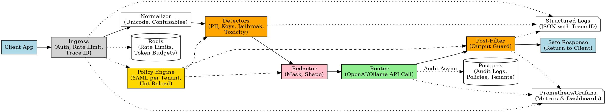
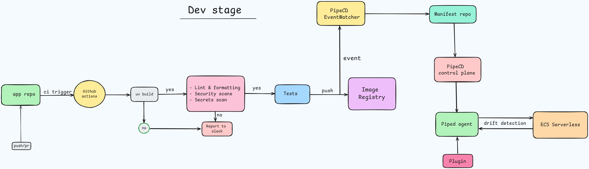

# PromptSafely 🚦

**PromptSafely** is a safety proxy that sits in front of LLM APIs (like OpenAI or Ollama).  
Its goal is to make prompts and responses **safe, policy-driven, and observable** — without app developers having to reinvent the wheel.

---

## Goals

- **Keep prompts safe** by filtering out sensitive data, secrets, and jailbreak attempts.  
- **Give teams control** through policies (YAML per tenant) that define redaction, blocking, and limits.  
- **Provide observability** with audit logs, structured logs, and Prometheus metrics.  
- **Control usage and costs** with per-tenant rate limits and token budgets.  
- **Drop-in proxy**: apps can point to PromptSafely instead of calling OpenAI directly

---

<!-- ## Architecture

--- -->

## GitOps CI/CD with PipeCD

### Why this setup
- Cluster changes only via Git.  
- Separate repo for manifest files.  
- CI does not have cluster creds.  
- Use of new PipeCD plugins → plug and deploy.  

> **Note:** For now doing this for the **dev stage**.  
> Directly updating the manifest is **not good for prod**; in that case, we will create a PR for human approval.  

---

## Phase 1 (MVP)

- **OpenAI-compatible proxy**: `/v1/chat/completions`  
- **Input filters**:  
  - PII (emails, phone numbers)  
  - API keys, JWTs  
  - Jailbreak phrases  
  - Basic toxicity words  
- **Redaction modes**:  
  - `mask`: `***`  
  - `shape-preserving`: `98******21`  
- **Output filters**: re-check model responses for leaks or prompt injections  
- **Policy engine**:  
  - YAML per tenant  
  - Hot-reloadable without restart  
- **Rate limiting & token budgets**: Redis-based counters  
- **Audit logs**:  
  - Stored in Postgres  
  - Record detectors triggered, actions taken, and outcomes  
- **Observability**:  
  - Prometheus metrics  
  - Structured JSON logs  
  - End-to-end trace IDs  
- **Health checks**: `/healthz`, `/readyz`, `/metrics`  

---

## Roadmap (Future Phases)

- Streaming support with mid-stream redaction/stop  
- Multi-tenant dashboards (Grafana)  
- Reversible tokenization with a vault  
- Replay sandbox for testing policies  
- Built-in red-team suite for jailbreak testing  

---
